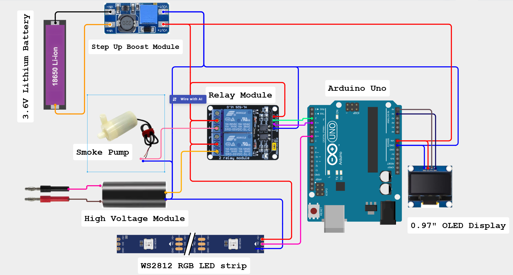

# Arduino Rocket Launch System

[](https://youtu.be/Js2AR38lMuU)

📺 **Watch the Full Build Video on YouTube**  
https://youtu.be/Js2AR38lMuU

---

## Project Overview

This project demonstrates a realistic and cinematic **Arduino Rocket Launch System** using an **Arduino UNO**, **Dual Relay Module**, **OLED Display**, **WS2812 RGB LEDs**, **Smoke Generator**, and a **High Voltage Ignition Module**.

The system simulates a real rocket launch sequence with:

* OLED countdown animation
* Smoke generation system
* RGB rocket fire effects
* High-voltage spark ignition
* Fully automated launch sequence

The smoke generator and RGB LEDs work together to create a realistic rocket exhaust effect, while the OLED display provides animated launch status updates.

The entire launch process is controlled automatically using custom Arduino programming.

This project is ideal for learning:

* Arduino automation
* Relay control systems
* OLED display interfacing
* WS2812 RGB LED effects
* Smoke simulation systems
* High-voltage ignition triggering
* DIY cinematic electronics projects

The full build process is available on the **AmithLabs YouTube channel**.

---

## Main Features

* Automated Rocket Launch Sequence
* OLED Countdown Animation
* Smoke Generation System
* RGB Rocket Fire Simulation
* High Voltage Spark Ignition
* Cinematic Launch Effects
* Arduino Controlled Automation
* DIY Mini Rocket Platform
* Beginner Friendly Electronics Project

---

## Hardware Components

* Arduino UNO
* Dual Relay Module
* 0.96" OLED Display (I2C SSD1306)
* WS2812 RGB LED Strip (3 LEDs)
* High Voltage Generator Module
* 3V Mini Water Pump
* DC Boost Converter Module
* 3.6V Lithium Battery
* Silicone Tube
* 60cc Syringe
* Copper Wires
* Connecting Wires
* Cardboard Sheets
* Hot Glue

---

## Pin Configuration

| Component              | Arduino UNO Pin |
| ---------------------- | ---------------- |
| OLED SDA               | A4               |
| OLED SCL               | A5               |
| RGB LED DIN            | D6               |
| Smoke Relay Control    | D2               |
| Ignition Relay Control | D3               |
| OLED VCC               | 5V               |
| Relay Module VCC       | 5V               |
| All GND Connections    | GND              |

---

## Schematic Diagram



---

## System Operation

1. Arduino powers ON and initializes all devices.
2. OLED display starts the animated countdown sequence.
3. Smoke generator activates automatically.
4. RGB LEDs simulate rocket fire effects.
5. OLED display shows launch status animations.
6. High-voltage ignition system activates.
7. Spark ignition simulates rocket lift-off.
8. System shuts down safely after launch.

---

## Smoke Generation System

The smoke effect is created using:

* Mini 3V water pump
* Rolled paper insert
* Perfume / alcohol / sanitizer vapor

The pump pushes smoke through the launch platform to simulate rocket exhaust.

---

## RGB Fire Effect

The WS2812 RGB LEDs simulate realistic rocket flames using animated orange, red, and warm glow effects.

Fire effect features:

* Random flickering
* Dynamic brightness changes
* Warm rocket exhaust colors
* Realistic launch atmosphere

---

## Arduino Code

The complete Arduino program is included in this repository:

```text
Arduino_Rocket_Launch_System.ino
